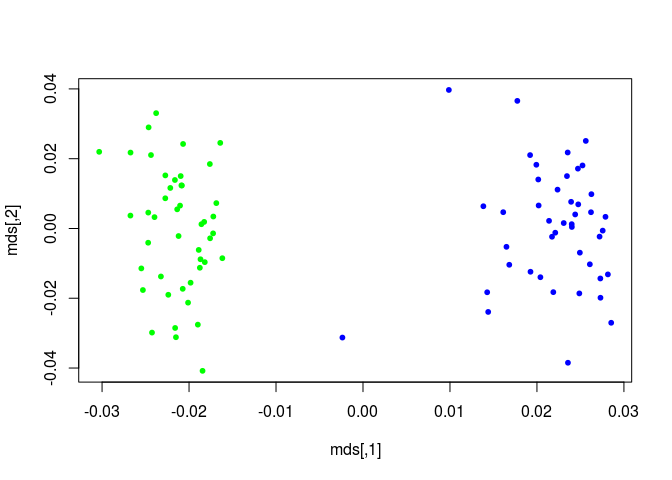

### Getting started

  - Run the getExamples.sh to download all the data

Just typing plink and specifying a file with no further options is a
good way to check that the file is intact, and to get some basic summary
statistics about the file.

``` bash
plink --file hapmap1
```

PED and MAP files are plain text files; PED files contain genotype
information (one person per row) and MAP files contain information on
the name and position of the markers in the PED file

    ## PLINK v1.90b4.9 64-bit (13 Oct 2017)
    ## Options in effect:
    ##   --file hapmap1
    ##   --make-bed
    ##   --out hapmap1
    ## 
    ## Hostname: defiance
    ## Working directory: /home/chowdhury.b/binf6309-sohailchd/GWAS
    ## Start time: Fri Apr 26 18:57:44 2019
    ## 
    ## Random number seed: 1556319464
    ## 193230 MB RAM detected; reserving 96615 MB for main workspace.
    ## Scanning .ped file... done.
    ## Performing single-pass .bed write (83534 variants, 89 people).
    ## --file: hapmap1-temporary.bed + hapmap1-temporary.bim + hapmap1-temporary.fam
    ## written.
    ## 83534 variants loaded from .bim file.
    ## 89 people (89 males, 0 females) loaded from .fam.
    ## 89 phenotype values loaded from .fam.
    ## Using 1 thread (no multithreaded calculations invoked).
    ## Before main variant filters, 89 founders and 0 nonfounders present.
    ## Calculating allele frequencies... done.
    ## Total genotyping rate is 0.99441.
    ## 83534 variants and 89 people pass filters and QC.
    ## Among remaining phenotypes, 44 are cases and 45 are controls.
    ## --make-bed to hapmap1.bed + hapmap1.bim + hapmap1.fam ... done.
    ## 
    ## End time: Fri Apr 26 18:57:45 2019

### Making a binary PED file

The first thing we will do is to make a binary PED file. This more
compact representation of the data saves space and speeds up subsequent
analysis. To make a binary PED file, use the following command.

``` bash
plink --file hapmap1 --make-bed --out hapmap1
```

If we wanted to create a new file that only includes individuals with
high genotyping (at least 95% complete), you would run:

``` bash
plink --file hapmap1 --make-bed --mind 0.05 --out highgeno
```

### Working with the binary PED file

``` bash
#Working with the binary PED file
#plink --bfile hapmap1
```

``` bash
cat plink.log
```

    ## PLINK v1.90b4.9 64-bit (13 Oct 2017)
    ## Options in effect:
    ##   --file hapmap1
    ## 
    ## Hostname: defiance
    ## Working directory: /home/chowdhury.b/binf6309-sohailchd/GWAS
    ## Start time: Fri Apr 26 18:58:00 2019
    ## 
    ## Random number seed: 1556319480
    ## 193230 MB RAM detected; reserving 96615 MB for main workspace.
    ## Scanning .ped file... done.
    ## Performing single-pass .bed write (83534 variants, 89 people).
    ## --file: plink.bed + plink.bim + plink.fam written.
    ## 
    ## End time: Fri Apr 26 18:58:00 2019

### Summary statistics: missing rates

Next we perform a similar analysis, except requesting allele frequencies
instead of genotyping rates. The following command generates a file
called freq\_stat.frq which contains the minor allele frequency and
allele codes for each SNP.

``` bash
# Summary statistics: missing rates
plink --bfile hapmap1 --missing --out miss_stat
```

Here we see that no individuals were removed for low genotypes (MIND \>
0.1 implies that we accept people with less than 10 percent
missingness).

The per individual and per SNP (after excluding individuals on the basis
of low genotyping) rates are then output to the files miss\_stat.imiss
and miss\_stat.lmiss respectively. If we had not specified an –out
option, the root output filename would have defaulted to “plink”.

``` bash
head miss_stat.imiss
```

    ##      FID  IID MISS_PHENO   N_MISS   N_GENO   F_MISS
    ##   HCB181    1          N      671    83534 0.008033
    ##   HCB182    1          N     1156    83534  0.01384
    ##   HCB183    1          N      498    83534 0.005962
    ##   HCB184    1          N      412    83534 0.004932
    ##   HCB185    1          N      329    83534 0.003939
    ##   HCB186    1          N     1233    83534  0.01476
    ##   HCB187    1          N      258    83534 0.003089
    ##   HCB188    1          N      864    83534  0.01034
    ##   HCB189    1          N      517    83534 0.006189

### Summary statistics: allele frequencies

Next we perform a similar analysis, except requesting allele frequencies
instead of genotyping rates. The following command generates a file
called freq\_stat.frq which contains the minor allele frequency and
allele codes for each SNP.

``` bash
# To perform a stratified analysis, use the --within option.
plink --bfile hapmap1 --freq --within pop.phe --out freq_stat
```

``` bash
head miss_stat.lmiss
```

    ##  CHR         SNP   N_MISS   N_GENO   F_MISS
    ##    1   rs6681049        0       89        0
    ##    1   rs4074137        0       89        0
    ##    1   rs7540009        0       89        0
    ##    1   rs1891905        0       89        0
    ##    1   rs9729550        0       89        0
    ##    1   rs3813196        0       89        0
    ##    1   rs6704013        2       89  0.02247
    ##    1    rs307347       12       89   0.1348
    ##    1   rs9439440        2       89  0.02247

If we were just interested in a specific SNP, and wanted to know what
the frequency was in the two populations, you can use the –snp option to
select this
SNP:

``` bash
plink --bfile hapmap1 --snp rs1891905 --freq --within pop.phe --out snp1_frq_stat
```

### Basic association analysis

Let’s now perform a basic association analysis on the disease trait for
all single SNPs. The basic command is

``` bash
plink --bfile hapmap1 --assoc --out as1
```

which generates an output file as1.assoc which contains the following
fields

``` bash
head as1.assoc
```

    ##  CHR         SNP         BP   A1      F_A      F_U   A2        CHISQ            P           OR 
    ##    1   rs6681049          1    1   0.1591   0.2667    2        3.067      0.07991       0.5203 
    ##    1   rs4074137          2    1  0.07955  0.07778    2     0.001919       0.9651        1.025 
    ##    1   rs7540009          3    0        0        0    2           NA           NA           NA 
    ##    1   rs1891905          4    1   0.4091      0.4    2      0.01527       0.9017        1.038 
    ##    1   rs9729550          5    1   0.1705  0.08889    2        2.631       0.1048        2.106 
    ##    1   rs3813196          6    1  0.03409  0.02222    2       0.2296       0.6318        1.553 
    ##    1   rs6704013          7    0        0        0    2           NA           NA           NA 
    ##    1    rs307347          8    0        0        0    2           NA           NA           NA 
    ##    1   rs9439440          9    0        0        0    2           NA           NA           NA

where each row is a single SNP association result. The fields are:
-Chromosome -SNP identifier -Code for allele 1 (the minor, rare allele
based on the entire sample frequencies) -The frequency of this variant
in cases -The frequency of this variant in controls -Code for the other
allele -The chi-squared statistic for this test (1 df) -The asymptotic
significance value for this test -The odds ratio for this test

In a Unix/Linux environment, one could simply use the available command
line tools to sort the list of association statistics and print out the
top ten, for
    example:

``` bash
sort --key=7 -nr as1.assoc | head
```

    ##    9    rs999510      47206    1   0.4091   0.3864    2      0.09488       0.7581          1.1 
    ##    9    rs999484      49016    1  0.02273  0.02222    2    0.0005167       0.9819        1.023 
    ##    9    rs999398      46425    1   0.1591   0.1889    2       0.2747       0.6002       0.8124 
    ##    9    rs998226      47266    1    0.375   0.4778    2        1.921       0.1657       0.6558 
    ##    9    rs997540      49756    1   0.3977   0.4333    2       0.2322       0.6299       0.8636 
    ##    9   rs9969732      48079    0        0        0    2           NA           NA           NA 
    ##    9   rs9969724      46038    0        0        0    2           NA           NA           NA 
    ##    9   rs9969710      47755    1   0.1023   0.1556    2        1.123       0.2893       0.6184 
    ##    9    rs995923      47709    1   0.2045   0.2444    2       0.4066       0.5237       0.7948 
    ##    9    rs995903      47398    1  0.04545      0.1    2        1.955        0.162       0.4286

To get a sorted list of association results, that also includes a range
of significance values that are adjusted for multiple testing, use the
–adjust flag:

``` bash
plink --bfile hapmap1 --assoc --adjust --out as2
```

This generates the file as2.assoc.adjust in addition to the basic
as2.assoc output file. Using head, one can easily look at one’s most
significant
    associations:

``` bash
head as2.assoc.adjusted
```

    ##  CHR         SNP      UNADJ         GC       BONF       HOLM   SIDAK_SS   SIDAK_SD     FDR_BH     FDR_BY
    ##   13   rs9585021  5.586e-06  4.994e-05     0.3839     0.3839     0.3188     0.3188    0.09719          1 
    ##    2   rs2222162  5.918e-06  5.232e-05     0.4068     0.4067     0.3342     0.3342    0.09719          1 
    ##    9  rs10810856  7.723e-06  6.483e-05     0.5308     0.5308     0.4118     0.4118    0.09719          1 
    ##    2   rs4675607   8.05e-06  6.703e-05     0.5533     0.5533     0.4249     0.4249    0.09719          1 
    ##    2   rs4673349  8.485e-06  6.994e-05     0.5832     0.5831     0.4419     0.4419    0.09719          1 
    ##    2   rs1375352  8.485e-06  6.994e-05     0.5832     0.5831     0.4419     0.4419    0.09719          1 
    ##   21    rs219746  1.228e-05  9.422e-05     0.8442     0.8441     0.5701     0.5701     0.1206          1 
    ##    1   rs4078404  2.667e-05   0.000176          1          1     0.8401       0.84     0.2291          1 
    ##   14   rs1152431  3.862e-05  0.0002374          1          1     0.9297     0.9297     0.2737          1

### Genotypic and other association models

``` bash
plink --bfile hapmap1 --model --snp rs2222162 --out mod1
```

This generates the file mod1.model which has more than one row per SNP,
representing the different tests performed for each SNP. The format of
this file is described here. The tests are the basic allelic test, the
Cochran-Armitage trend test, dominant and recessive models and a
genotypic test. All test statistics are distributed as chi-squared with
1 df under the null, with the exception of the genotypic test which has
2
    df.

``` bash
head mod1.model 
```

    ##  CHR         SNP   A1   A2     TEST            AFF          UNAFF        CHISQ   DF            P
    ##    2   rs2222162    1    2     GENO        3/19/22        17/22/6           NA   NA           NA
    ##    2   rs2222162    1    2    TREND          25/63          56/34        19.15    1    1.207e-05
    ##    2   rs2222162    1    2  ALLELIC          25/63          56/34        20.51    1    5.918e-06
    ##    2   rs2222162    1    2      DOM          22/22           39/6           NA   NA           NA
    ##    2   rs2222162    1    2      REC           3/41          17/28           NA   NA           NA

To force the genotypic tests for this particular SNP just for
illustrative purposes, we need to run:

``` bash
plink --bfile hapmap1 --model --cell 0 --snp rs2222162 --out mod2
```

Now the genotypic tests will also be calculated, as we set the minimum
number in each cell to 0. We see that the genotype counts in affected
and unaffected individuals
    are

``` bash
head mod2.model 
```

    ##  CHR         SNP   A1   A2     TEST            AFF          UNAFF        CHISQ   DF            P
    ##    2   rs2222162    1    2     GENO        3/19/22        17/22/6        19.15    2    6.932e-05
    ##    2   rs2222162    1    2    TREND          25/63          56/34        19.15    1    1.207e-05
    ##    2   rs2222162    1    2  ALLELIC          25/63          56/34        20.51    1    5.918e-06
    ##    2   rs2222162    1    2      DOM          22/22           39/6        13.87    1    0.0001958
    ##    2   rs2222162    1    2      REC           3/41          17/28        12.24    1    0.0004679

### Stratification analysis

``` bash
plink --bfile hapmap1 --cluster --mc 2 --ppc 0.05 --out str1
```

which indicate that IBS-clustering has been performed. These files are
described in the main documentation. The file str1.cluster1 contains the
results of clustering in a format that is easy to read:

``` bash
head str1.cluster1
```

    ## SOL-0     HCB181_1 JPT260_1
    ## SOL-1     HCB182_1 HCB225_1
    ## SOL-2     HCB183_1 HCB194_1
    ## SOL-3     HCB184_1 HCB202_1
    ## SOL-4     HCB185_1 HCB217_1
    ## SOL-5     HCB186_1 HCB201_1
    ## SOL-6     HCB187_1 HCB189_1
    ## SOL-7     HCB188_1 HCB206_1
    ## SOL-8     HCB190_1 HCB224_1
    ## SOL-9     HCB191_1 HCB220_1

### Association analysis, accounting for clusters

After having performed the above matching based on genome-wide IBS, we
can now perform the association test conditional on the matching. For
this, the relevant file is the str1.cluster2 file, which contains the
same information as str1.cluster1 but in the format of a cluster
variable file, that can be used in conjunction with the –within
    option.

``` bash
plink --bfile hapmap1 --mh --within str1.cluster2 --adjust --out aac1
```

``` bash
head aac1.cmh.adjusted
```

    ##  CHR         SNP      UNADJ         GC       BONF       HOLM   SIDAK_SS   SIDAK_SD     FDR_BH     FDR_BY
    ##   13   rs9585021  1.906e-06  4.418e-06     0.1274     0.1274     0.1196     0.1196     0.1274          1 
    ##   21   rs3017432  2.209e-05  4.332e-05          1          1     0.7716     0.7716     0.7384          1 
    ##    2   rs2222162  4.468e-05  8.353e-05          1          1     0.9496     0.9495     0.8734          1 
    ##   17   rs3829612  7.177e-05  0.0001299          1          1     0.9918     0.9918     0.8734          1 
    ##    2   rs4673349  9.617e-05  0.0001707          1          1     0.9984     0.9984     0.8734          1 
    ##    2   rs1375352  9.617e-05  0.0001707          1          1     0.9984     0.9984     0.8734          1 
    ##   15   rs4887466  0.0001215  0.0002123          1          1     0.9997     0.9997     0.8734          1 
    ##   12  rs12823722    0.00026  0.0004317          1          1          1          1     0.8734          1 
    ##    9   rs2025330    0.00026  0.0004317          1          1          1          1     0.8734          1

We can also perform the clustering, but with fewer, or different,
constraints on the final
solution.

``` bash
plink --bfile hapmap1 --cluster --K 2 --out version3
```

### Quantitative trait association analysis

``` bash
plink --bfile hapmap1 --assoc --pheno qt.phe --out quant1
```

``` bash
## We request clustered permutation as follows, using the original pairing approach to matching:
plink --bfile hapmap1 --assoc --pheno qt.phe --perm --within str1.cluster2 --out quant2
```

``` bash
### Extracting a SNP of interest
plink --bfile hapmap1 --snp rs2222162 --recodeAD --out rec_snp1
```

### Association analysis, accounting for clusters

Finally, it is possible to generate a visualisation of the substructure
in the sample by creating a matrix of pairwsie IBS distances, then using
a statistical package such as R to generate a multidimensional scaling
plot, for example: use

``` r
m <- as.matrix(read.table(params$filename))
mds <- cmdscale(as.dist(1-m))
k <- c( rep("green",45) , rep("blue",44) )
plot(mds,pch=20,col=k)
```

<!-- -->

This plot certainly seems to suggest that at least two quite distinct
clusters exist in the sample. Based on viewing this kind of plot, one
would be in a better position to determine which approach to
stratification to subsequently take.

### Quantitative trait association analysis

Let’s now analyse this quantitative trait
    directly.

``` bash
plink --bfile hapmap1 --assoc --pheno qt.phe --out quant1
```

``` bash
head quant1.qassoc
```

    ##  CHR         SNP         BP    NMISS       BETA         SE         R2        T            P 
    ##    1   rs6681049          1       89    -0.2266     0.3626   0.004469  -0.6249       0.5336 
    ##    1   rs4074137          2       89    -0.2949     0.6005   0.002765  -0.4911       0.6246 
    ##    1   rs7540009          3       89         NA         NA         NA       NA           NA 
    ##    1   rs1891905          4       89    -0.1053     0.3165   0.001272  -0.3328       0.7401 
    ##    1   rs9729550          5       89     0.5402     0.4616     0.0155     1.17       0.2451 
    ##    1   rs3813196          6       89     0.8053      1.025    0.00705   0.7859        0.434 
    ##    1   rs6704013          7       87         NA         NA         NA       NA           NA 
    ##    1    rs307347          8       77         NA         NA         NA       NA           NA 
    ##    1   rs9439440          9       87         NA         NA         NA       NA           NA

Instead of performing a stratified analysis or including covariates, one
approach is to use permutation: specifically, it is possible to permute
(i.e. label-swap phenotypes between individuals) but only within
cluster.

``` bash
plink --bfile hapmap1 --assoc --pheno qt.phe --perm --within str1.cluster2 --out quant2
```

``` bash
head quant2.qassoc.perm
```

    ##  CHR         SNP         EMP1           NP 
    ##    1   rs6681049         0.44           49 
    ##    1   rs4074137       0.6667           20 
    ##    1   rs7540009           NA           NA 
    ##    1   rs1891905        0.625           23 
    ##    1   rs9729550       0.0571          612 
    ##    1   rs3813196       0.3676           67 
    ##    1   rs6704013           NA           NA 
    ##    1    rs307347           NA           NA 
    ##    1   rs9439440           NA           NA

### Extracting a SNP of interest

Finally, given you’ve identified a SNP, set of SNPs or region of
interest, you might want to extract those SNPs as a separate, smaller,
more manageable file. In particular, for other applications to analyse
the data, you will need to convert from the binary PED file format to a
standard PED format. This is done using the –recode options (fully
described here). There are a few forms of this option: we will use the
–recodeAD that codes the genotypes in a manner that is convenient for
subsequent analysis in R or any other non-genetic statistical package.
To extract only this single SNP.

``` bash
plink --bfile hapmap1 --snp rs2222162 --recodeAD --out rec_snp1
```

We can then load this file into our statistics package and easily
perform other analyses: for example, to repeat the main analysis as a
simple logistic regression using the R package (not controlling for
clusters):

``` r
d <- read.table(params$filename2 , header=T)
summary(glm(PHENOTYPE-1 ~ rs2222162_1, data=d, family="binomial"))
```

    ## 
    ## Call:
    ## glm(formula = PHENOTYPE - 1 ~ rs2222162_1, family = "binomial", 
    ##     data = d)
    ## 
    ## Deviance Residuals: 
    ##     Min       1Q   Median       3Q      Max  
    ## -1.7690  -1.1042  -0.5848   0.6851   1.9238  
    ## 
    ## Coefficients:
    ##             Estimate Std. Error z value Pr(>|z|)    
    ## (Intercept)   1.3300     0.4107   3.238   0.0012 ** 
    ## rs2222162_1  -1.5047     0.3765  -3.997 6.42e-05 ***
    ## ---
    ## Signif. codes:  0 '***' 0.001 '**' 0.01 '*' 0.05 '.' 0.1 ' ' 1
    ## 
    ## (Dispersion parameter for binomial family taken to be 1)
    ## 
    ##     Null deviance: 123.37  on 88  degrees of freedom
    ## Residual deviance: 102.64  on 87  degrees of freedom
    ## AIC: 106.64
    ## 
    ## Number of Fisher Scoring iterations: 4

which confirms the original analysis. Naturally, things such as survival
analysis or other models not implemented in PLINK can now be performed.

### References

Package:  
PLINK (including version number)  
Author: Shaun Purcell  
URL: <http://pngu.mgh.harvard.edu/purcell/plink/>

``` 
    Purcell S, Neale B, Todd-Brown K, Thomas L, Ferreira MAR,   
Bender D, Maller J, Sklar P, de Bakker PIW, Daly MJ & Sham PC (2007)   
    PLINK: a toolset for whole-genome association and population-based    
linkage analysis. American Journal of Human Genetics, 81.   
```
